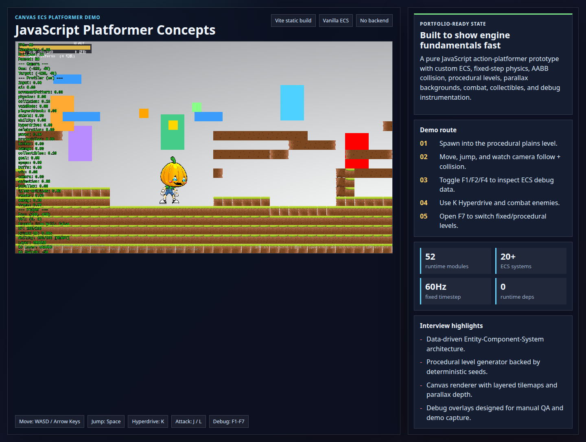
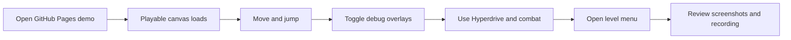
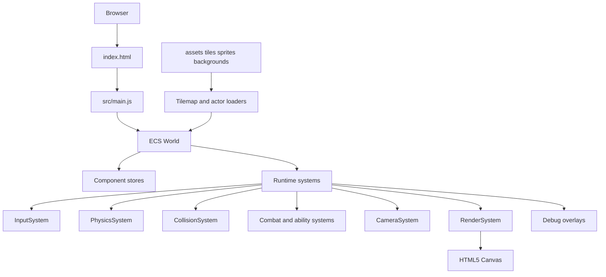
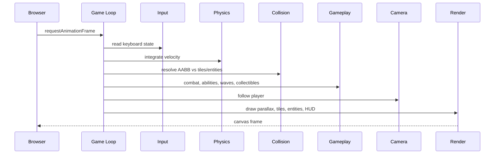
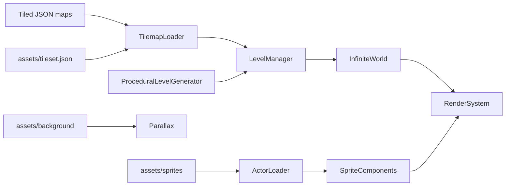
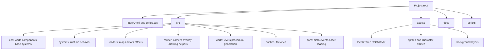
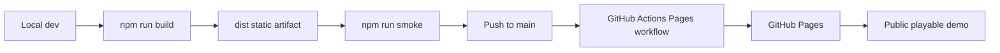
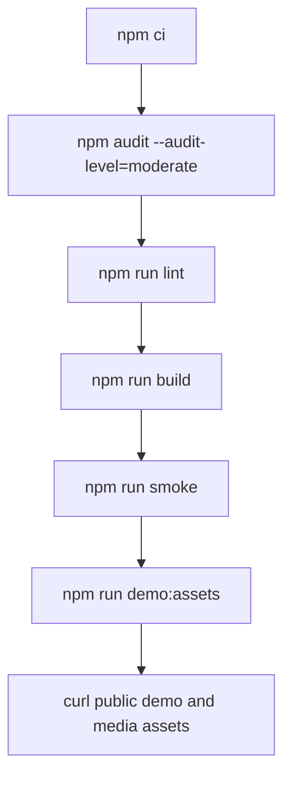

# JavaScript Platformer Concepts

> Portfolio-ready 2D action-platformer prototype built with vanilla JavaScript, HTML5 Canvas, Vite, and a custom Entity-Component-System runtime.

[Live Demo](https://justin21523.github.io/javascript-platformer-concepts/) · [Portfolio Case Study](https://justin21523.github.io/zh-TW/projects/javascript-platformer-concepts/) · [Demo Assets](docs/demo/README.md)



## Project Value

This project demonstrates browser game-engine fundamentals without Phaser, Pixi, Unity, or a backend. The public demo is designed for interview review: the first screen is the playable canvas, and the surrounding panel explains the runtime, demo route, and engineering highlights.

| Area | Current state |
| --- | --- |
| Product positioning | 2D action-platformer engine prototype and gameplay systems lab |
| Frontend | Vite static site, ES modules, HTML5 Canvas renderer |
| Backend | None; the public demo is fully static |
| Database | None; state is in browser memory and deterministic seeds |
| APIs | Browser APIs only: Canvas, keyboard events, Fetch, localStorage |
| Deployment | GitHub Pages via GitHub Actions |
| Demo mode | `?demo=1` enables stable debug defaults and Playwright readiness flags |
| Automated checks | JS syntax check, Vite build, Playwright production smoke |

## Demo Flow

| Step | What to show | Interview signal |
| --- | --- | --- |
| 1 | Open the live demo | Product-first static deployment |
| 2 | Move and jump with WASD/arrow keys + Space | Physics, collision, camera follow |
| 3 | Press `F1`, `F2`, `F4` | ECS diagnostics, hitboxes, tile grid |
| 4 | Press `K` and fight enemies | Ability/combat systems and VFX |
| 5 | Press `F7` | Static and procedural level switching |



## Feature Checklist

| Feature | Status | Notes |
| --- | --- | --- |
| Custom ECS runtime | Complete | Entity registry, components, systems, queries |
| Fixed timestep simulation | Complete | 60Hz update loop with render decoupling |
| AABB tile collision | Complete | Per-axis collision and debug hitboxes |
| Camera follow | Complete | Player-following camera with dead zone |
| Tiled JSON/static levels | Complete | Static map loader and layer support |
| Procedural levels | Complete | Seeded generator for plains, ruins, clouds |
| Combat systems | Complete | Enemies, hitboxes, damage, shield, projectiles |
| Collectibles and buffs | Complete | Health, energy, and haste-style pickups |
| Parallax backgrounds | Complete | Layered Canvas background rendering |
| Debug tooling | Complete | Overlay, hitbox, grid, slow-mo, panel, level menu |
| Public demo hardening | Complete | Stable asset paths, smoke test, captured media |

## Architecture



## Runtime Pipeline



## Data And Asset Flow



## Module Organization



## Deployment Architecture



## Commands

```bash
npm ci
npm run dev
npm run lint
npm run build
npm run preview
npm run smoke
npm run demo:assets
```

## Controls

| Input | Action |
| --- | --- |
| `WASD` / Arrow keys | Move |
| `Space` | Jump |
| `J` / `L` | Attack variants |
| `K` | Hyperdrive |
| `F1` | Metrics overlay |
| `F2` | Hitboxes |
| `F3` | Slow motion |
| `F4` | Tile grid |
| `F6` | Debug panel |
| `F7` | Level menu |
| Backtick | Pause |
| `.` | Step one frame while paused |

## Demo Evidence

| Asset | Location |
| --- | --- |
| Playable first screen | `docs/demo/screenshots/01-playable-canvas.png` |
| Debug hitboxes/grid | `docs/demo/screenshots/02-debug-hitboxes-grid.png` |
| Level menu | `docs/demo/screenshots/03-level-menu.png` |
| Hyperdrive/combat | `docs/demo/screenshots/04-hyperdrive-combat.png` |
| Mobile layout | `docs/demo/screenshots/05-mobile.png` |
| Guided recording | `docs/demo/video/demo-walkthrough.webm` |

## Quality Gates



## Risks And Mitigations

| Risk | Mitigation |
| --- | --- |
| Asset path breakage on GitHub Pages | Runtime assets resolve through `import.meta.env.BASE_URL`; build copies `assets/` into `dist/assets/`. |
| No full unit suite | Production Playwright smoke verifies runtime load, key asset content types, and nonblank canvas rendering. |
| Debug overlay can be visually busy | Demo screenshots include both clean and diagnostic states. |
| No backend/API | Intentional; this is a fully static browser game prototype. |

## Interview Highlights

- Practical ECS decomposition: components stay data-only while systems own behavior.
- Fixed-step gameplay simulation and Canvas rendering without game framework dependencies.
- Hand-authored Tiled levels plus deterministic procedural generation.
- Reproducible smoke/capture tooling produces portfolio evidence from the real production build.
