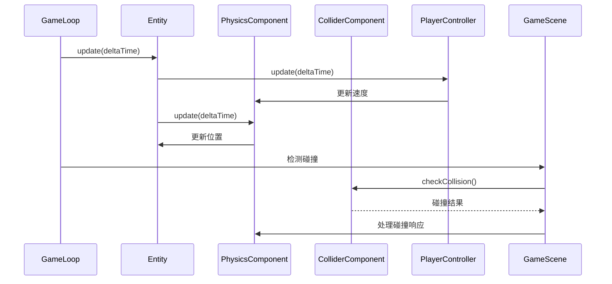
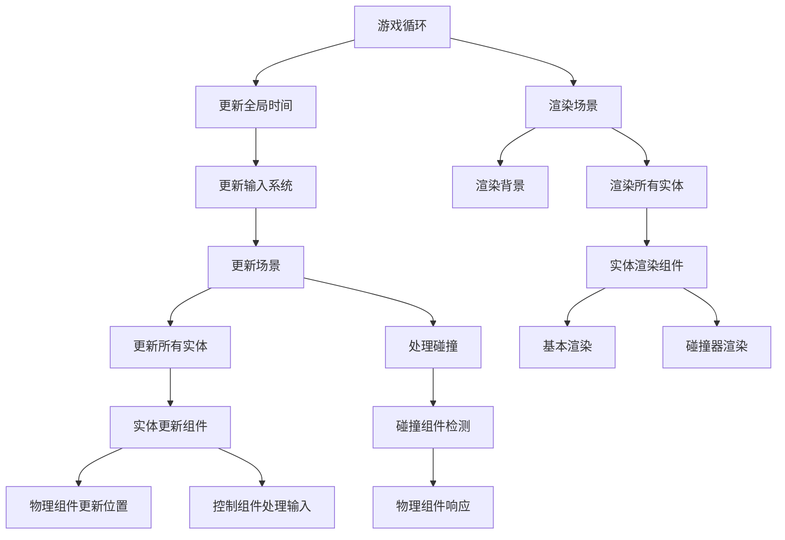
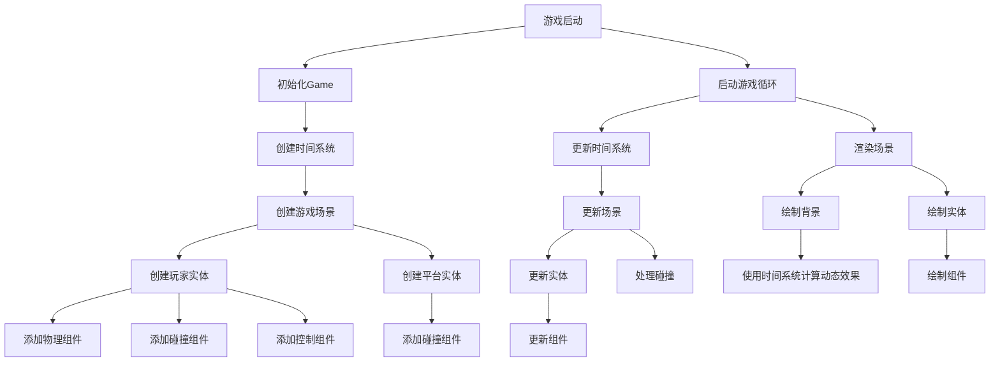

组件分工：

PhysicsComponent：处理重力、速度、摩擦力等物理模拟

ColliderComponent：处理碰撞检测和响应

PlayerController：处理玩家输入响应


### 为什么需要组件系统？

1. **解决继承的局限性**：
   - 传统OOP中，多重继承复杂且易出错
   - 组件系统使用组合而非继承，更灵活

2. **关注点分离**：
   ```mermaid
   graph LR
   A[游戏实体] --> B[物理组件]
   A --> C[渲染组件]
   A --> D[控制组件]
   A --> E[碰撞组件]
   ```

3. **代码复用性**：
   - 相同组件可用于不同实体
   - 如物理组件既可用于玩家，也可用于敌人

### 组件系统工作流程



### 关键组件解析

1. **PhysicsComponent**：
   - 负责模拟物理行为（重力、速度、摩擦力）
   - 与其他组件解耦，只关心物理规则
   - 可复用性高，可用于任何需要物理模拟的实体

2. **ColliderComponent**：
   - 封装碰撞检测逻辑
   - 支持多种碰撞器类型（盒子、圆形）
   - 提供统一的碰撞检测接口
   - 与渲染分离，只处理碰撞逻辑

3. **PlayerController**：
   - 处理玩家输入到行为的转换
   - 隔离输入处理与物理模拟
   - 易于扩展新的控制方式


## 组件系统优势总结

1. **灵活性**：
   - 添加新功能只需添加新组件
   - 无需修改现有实体结构

2. **可维护性**：
   - 每个组件职责单一
   - 降低代码耦合度

3. **性能优化**：
   - 可针对特定组件优化
   - 禁用不必要组件节省资源

4. **协作友好**：
   - 不同开发者负责不同组件
   - 减少代码冲突


## 4. 波浪效果原理详解

### 正弦函数在游戏中的应用

```javascript
// 星星大小变化公式
const size = Math.sin(this.time.gameTime * frequency + phaseOffset) * amplitude + baseSize;

// 山脉高度变化公式
const height = baseHeight + Math.sin(this.time.gameTime * frequency + phaseOffset) * amplitude;
```

#### 参数解释：
1. **`this.time.gameTime`**:
   - 游戏运行的总时间（秒）
   - 随时间线性增长，提供连续变化的基础

2. **`frequency`** (频率):
   - 控制变化速度的系数
   - 值越大，变化越快（波浪更密集）
   - 例：`frequency = 2` 表示每秒完成2个完整周期

3. **`phaseOffset`** (相位偏移):
   - 每个实例的初始偏移量
   - 使不同对象的变化不同步
   - 例：`i` 作为偏移使每个星星/山脉有独特行为

4. **`amplitude`** (振幅):
   - 控制变化范围的系数
   - 值越大，波动范围越大
   - 例：星星大小振幅为1，表示在基础大小上下波动1像素

5. **`baseSize/baseHeight`** (基准值):
   - 波动的中心值
   - 例：星星基础大小为1.5，实际大小在0.5-2.5之间波动

#### 视觉表现：
1. **星星效果**:
   ```javascript
   const size = Math.sin(this.time.gameTime * 2 + i) * 1 + 1.5;
   ```
   - 每颗星星大小在0.5px到2.5px之间变化
   - 变化速度：每秒2个完整周期（放大→缩小→放大）
   - 相位偏移：每颗星星有独特的变化节奏
   - 效果：星星群体呈现呼吸般的脉动效果，像在闪烁

2. **山脉效果**:
   ```javascript
   const height = 100 + Math.sin(this.time.gameTime * 0.5 + i) * 20;
   ```
   - 山脉高度在80px到120px之间变化
   - 变化速度：每秒0.5个周期（较缓慢）
   - 相位偏移：每座山脉变化不同步
   - 效果：山脉呈现缓慢起伏的波浪状运动，像远处山峦在月光下若隐若现


## 波浪效果数学原理详解

### 正弦函数基础

正弦函数 `Math.sin(θ)` 是最基本的周期函数：
- 输入角度 θ (弧度制)
- 输出范围：[-1, 1]
- 周期：2π (约6.28)

### 游戏中的参数映射

在游戏中，我们将时间映射为角度：

```
θ = (time * frequency) + phaseOffset
```

#### 1. 时间因子 (`time`)
- 游戏运行时间（秒）
- 随时间线性增加：`time = t` (t > 0)
- 提供连续变化的基础

#### 2. 频率因子 (`frequency`)
- 控制变化速度
- 物理意义：角速度 (弧度/秒)
- 公式关系：`周期 = 2π / frequency`
- 示例：
  - `frequency = 1` → 周期6.28秒
  - `frequency = 2` → 周期3.14秒

#### 3. 相位偏移 (`phaseOffset`)
- 控制初始相位
- 使相同函数产生不同结果
- 示例：`i * 1.0` 给每个实例不同偏移

#### 4. 振幅 (`amplitude`)
- 控制输出范围
- 最终输出：`base + amplitude * sin(θ)`
- 示例：`size = 1.5 + 1.0 * sin(θ)`
  - 最小值：1.5 - 1.0 = 0.5
  - 最大值：1.5 + 1.0 = 2.5

### 视觉表现模拟

以下是不同参数组合的视觉效果：

| 参数组合 | 频率 | 振幅 | 相位偏移 | 视觉效果描述 |
|---------|------|------|----------|------------|
| `sin(t)` | 1.0 | 1.0 | 0 | 缓慢平稳的脉动，所有对象同步 |
| `sin(t*3)` | 3.0 | 1.0 | 0 | 快速闪烁效果，所有对象同步闪烁 |
| `sin(t*2 + i)` | 2.0 | 1.0 | i | 波浪式脉动，对象依次闪烁 |
| `sin(t*0.5 + i*2)` | 0.5 | 20 | i*2 | 缓慢起伏的波浪，对象间有较大差异 |

### 为什么使用正弦函数？

1. **平滑性**：
   - 正弦变化是连续的
   - 无突然跳跃，视觉效果自然

2. **周期性**：
   - 自动循环，无需额外控制
   - 适合持续动画效果

3. **可控性**：
   - 通过参数精确控制效果
   - 易于调整和优化

4. **性能高效**：
   - 计算开销小
   - 适合每帧调用

## 组件系统工作流程



## 总结与预期效果

### 完整实现的系统
1. **时间系统**：统一管理游戏时间，支持时间缩放
2. **组件系统**：实体-组件架构完整实现
3. **物理系统**：重力、摩擦力、碰撞检测
4. **渲染系统**：分层渲染，支持调试模式
5. **输入系统**：键盘输入处理

### 波浪效果预期表现
1. **星星效果**：
   - 100颗星星均匀分布
   - 每颗星星大小在0.5-2.5px之间变化
   - 变化速度：每秒2个周期
   - 相位偏移：形成波浪式脉动
   - 视觉效果：夜空中的星星柔和闪烁

2. **山脉效果**：
   - 5座山脉水平分布
   - 高度在80-120px之间变化
   - 变化速度：每2秒一个周期
   - 相位偏移：山脉起伏不同步
   - 视觉效果：远处山峦缓慢起伏

### 玩家渲染优化
1. **相对位置**：
   - 眼睛、嘴巴使用比例定位
   - 自适应玩家尺寸变化

2. **状态反馈**：
   - 跳跃时显示粒子效果
   - 表情反映角色状态
   - 调试模式显示碰撞框

3. **组件集成**：
   - 正确获取物理组件状态
   - 碰撞框只在调试模式显示

### 调试功能
1. **F1切换**：按F1键切换调试模式
2. **视觉反馈**：
   - 红色碰撞框
   - 黄色跳跃粒子
   - 正弦波可视化
3. **信息面板**：显示调试状态提示


## 系统工作流程


